# FlashKV (C++)

A small, multi-threaded, Redis-compatible in-memory key/value server written in C++ from scratch using raw POSIX sockets. It speaks the **RESP** protocol, so it works with `redis-cli` and `redis-benchmark`.

---

## Table of Contents

1. [Features](#features)
2. [Build & Run](#build--run)
3. [Architecture Overview](#architecture-overview)
4. [Code Walkthrough](#code-walkthrough)
   - [Data Model](#1-data-model)
   - [Time Handling](#2-time-handling-now_ms)
   - [RESP Parser](#3-resp-parser-respparser)
   - [Client Handler](#4-client-handler-handle_client)
   - [Command Reference](#5-commands)
   - [Server Startup (`main`)](#6-server-startup-main)
5. [Threading & Concurrency](#threading--concurrency-model)
6. [Key Expiry (TTL)](#key-expiry-ttl)
7. [Example Session](#example-session)
8. [Known Limitations](#known-limitations)
9. [Ideas for Future Work](#ideas-for-future-work)

---

## Features

| Feature | Details |
|---|---|
| Protocol | RESP arrays of bulk strings **and** inline commands (used by `redis-benchmark`) |
| Commands | `PING`, `ECHO`, `SET` (with `PX`), `GET`, `CONFIG` (stubbed) |
| Expiry | Millisecond TTL via `SET key value PX <ms>`, lazily enforced on `GET` |
| Concurrency | One detached thread per client, shared store protected by a mutex |
| Pipelining | Multiple commands in one TCP read are all parsed and executed |
| Case-insensitive | `get`, `GET`, `Get` all work |
| Port | `6379` (default Redis port), bound on `0.0.0.0` |

---

## Build & Run

```bash
# Compile (C++11 or newer, pthreads required)
g++ -std=c++17 -O2 -pthread main.cpp -o mini-redis

# Run
./mini-redis
```

Talk to it using the real Redis tools:

```bash
redis-cli -p 6379 PING
redis-benchmark -p 6379 -t set,get -n 100000 -q
```

---

## Architecture Overview

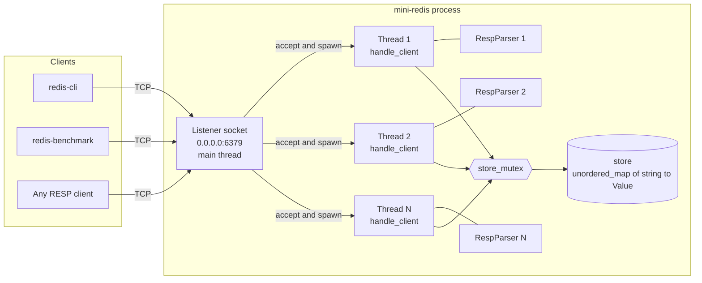

**In one sentence:** the main thread only accepts connections; every client gets its own thread with its own private parser; all threads share one global hash map guarded by a single mutex.

---

## Code Walkthrough

### 1. Data Model

```cpp
struct Value {
    string data;
    long long expiry;   // absolute time in ms, or -1 = never expires
};

unordered_map<string, Value> store;
mutex store_mutex;
```

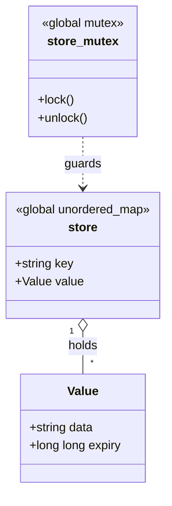

- `data` is the stored string.
- `expiry` is an **absolute** deadline in milliseconds (`now_ms() + ttl`), not a countdown. `-1` is a sentinel meaning "no expiry".
- `store` and `store_mutex` are globals, shared by every client thread.

---

### 2. Time Handling (`now_ms`)

```cpp
long long now_ms() {
    return duration_cast<milliseconds>(steady_clock::now().time_since_epoch()).count();
}
```

It uses `std::chrono::steady_clock` (a **monotonic** clock) instead of `system_clock`. That means key expiry is not affected if someone changes the system date/time, or if NTP adjusts the clock.

---

### 3. RESP Parser (`RespParser`)

TCP is a **stream**, not a message protocol. One `recv()` can contain half a command, exactly one command, or several commands. `RespParser` solves this by buffering bytes and only returning a command when a complete frame is available.

```cpp
class RespParser {
    string buffer;                               // bytes received but not yet consumed
    void append(const char* data, int len);      // push new bytes in
    bool parse(vector<string>& result);          // try to extract ONE full command
};
```

#### What RESP looks like on the wire

`SET name alice` is sent by `redis-cli` as:

```
*3\r\n          <- array of 3 elements
$3\r\n          <- bulk string, 3 bytes
SET\r\n
$4\r\n
name\r\n
$5\r\n
alice\r\n
```

#### Parsing flow

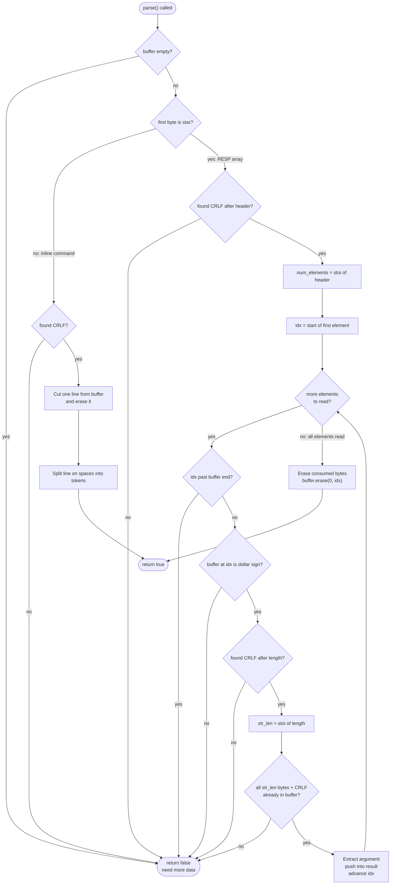

Key design points:

- **Incomplete frames are never consumed.** If anything is missing, `parse` returns `false` *without* touching the buffer. Next time more bytes arrive, parsing restarts from the beginning of the same frame.
- **Complete frames are erased** from the buffer, so any bytes that follow (the next pipelined command) remain ready for the next `parse()` call.
- **Inline protocol** (e.g. plain `PING\r\n`) is handled first. `redis-benchmark` and `telnet`/`nc` sessions use it.
- **Length-prefixed** reading means values can safely contain spaces, `\r\n`, or any binary bytes.

---

### 4. Client Handler (`handle_client`)

Every accepted connection runs this function in its own thread.

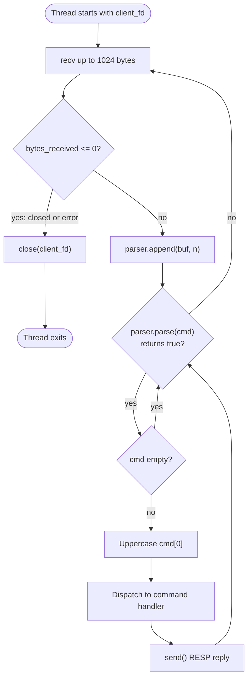

The **inner `while (parser.parse(cmd))` loop** is what gives you pipelining: after one `recv()`, it keeps executing commands until the parser says the buffer holds no more complete frames, and only then goes back to `recv()`.

---

### 5. Commands

#### Dispatch overview

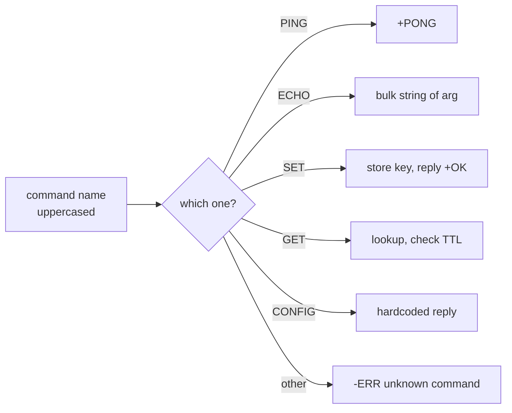

#### Command table

| Command | Syntax | Reply | Notes |
|---|---|---|---|
| `PING` | `PING` | `+PONG` | Simple string reply |
| `ECHO` | `ECHO msg` | `$len\r\nmsg` | Bulk string. Error if no argument |
| `SET` | `SET key value [PX ms]` | `+OK` | Needs at least 3 tokens. `PX` sets a TTL in ms |
| `GET` | `GET key` | `$len\r\nvalue` or `$-1` | `$-1` is the RESP "null bulk string" (key missing or expired) |
| `CONFIG` | `CONFIG ...` | Array with `maxmemory` / `0` | Stub so `redis-benchmark` can finish its startup handshake |
| anything else | | `-ERR unknown command` | |

Error replies use the RESP error prefix `-ERR ...`.

#### SET in detail

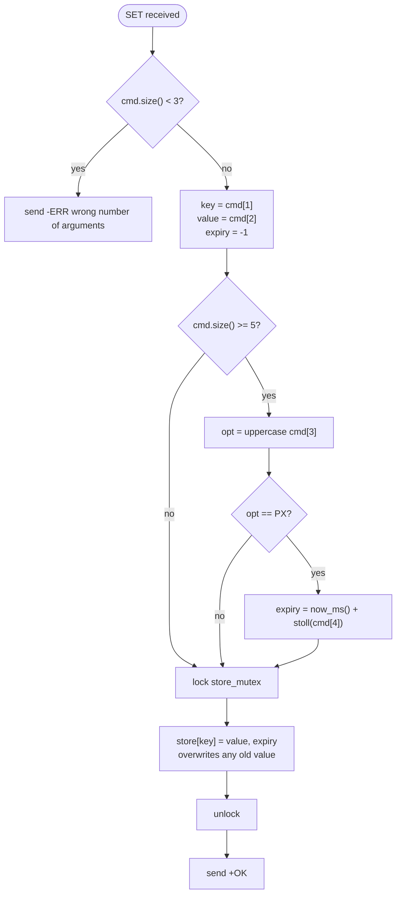

#### GET in detail

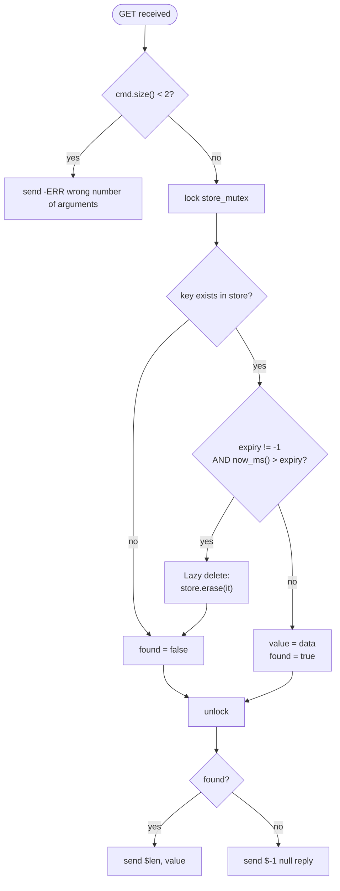

Note that the **response is sent after the lock is released**. Network I/O can be slow, and holding the mutex during `send()` would block every other client.

---

### 6. Server Startup (`main`)

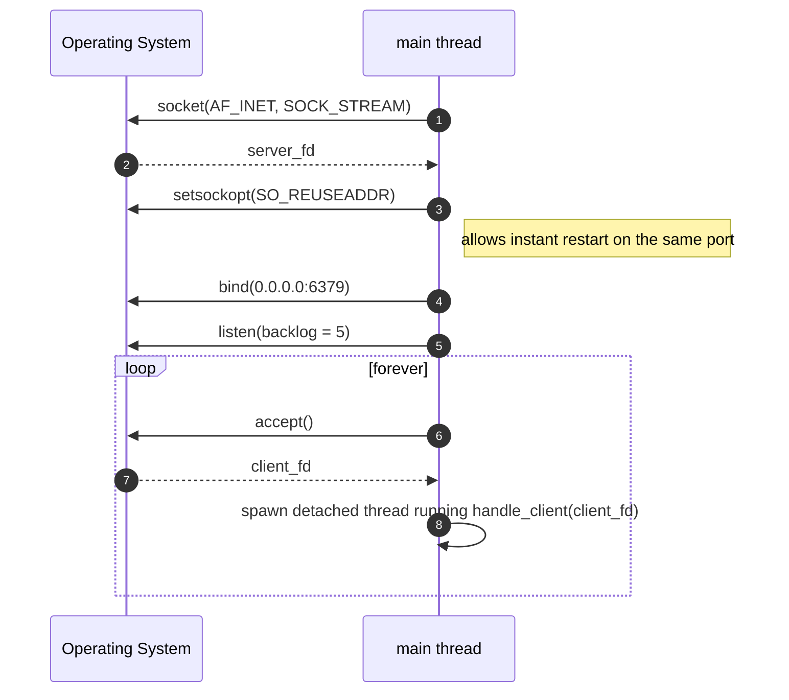

Details:

- `AF_INET` + `SOCK_STREAM` = IPv4 TCP.
- `SO_REUSEADDR` avoids the "Address already in use" error when restarting quickly.
- `INADDR_ANY` means the server listens on all network interfaces.
- `std::unitbuf` makes `cout`/`cerr` flush after every write, so logs appear instantly.
- `.detach()` lets each client thread run independently; the main thread never joins them.

---

## Threading & Concurrency Model

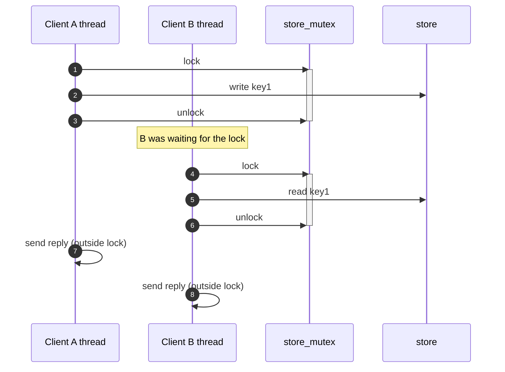

- **Per-client state is private.** Each thread has its own `buf` and its own `RespParser`, so no locking is needed for parsing.
- **Only `store` is shared.** Every access, read or write, goes through `lock_guard<mutex>`, which unlocks automatically when the scope ends (RAII), even on early exit.
- **Critical sections are tiny.** Only the map operation sits inside the lock; formatting and `send()` happen outside.

---

## Key Expiry (TTL)

This server uses **lazy expiration**: nothing runs in the background. A key's expiry is only checked at the moment it is read.

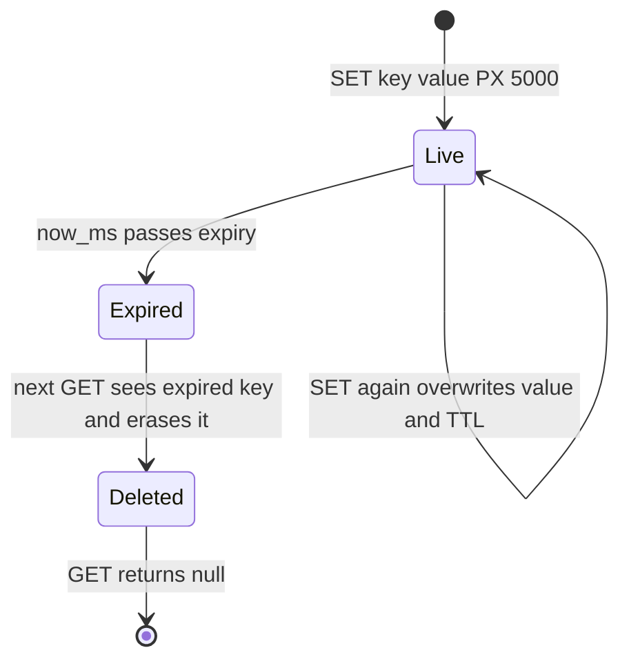

Timeline example:

```mermaid
gantt
    title SET foo bar PX 3000
    dateFormat X
    axisFormat %ss
    section Key lifetime
    Readable          :active, 0, 3
    Logically expired :crit, 3, 6
    section Client
    GET returns bar   :milestone, 1, 0
    GET returns null  :milestone, 4, 0
```

> A key that is never read again after expiring stays in memory forever (see [limitations](#known-limitations)).

---

## Example Session

```text
$ redis-cli -p 6379
127.0.0.1:6379> PING
PONG
127.0.0.1:6379> ECHO "hello world"
"hello world"
127.0.0.1:6379> SET name alice
OK
127.0.0.1:6379> GET name
"alice"
127.0.0.1:6379> SET session abc123 PX 2000
OK
127.0.0.1:6379> GET session
"abc123"
   ... wait 2+ seconds ...
127.0.0.1:6379> GET session
(nil)
127.0.0.1:6379> FLUSHALL
(error) ERR unknown command
```

Full request/response lifecycle for one command:

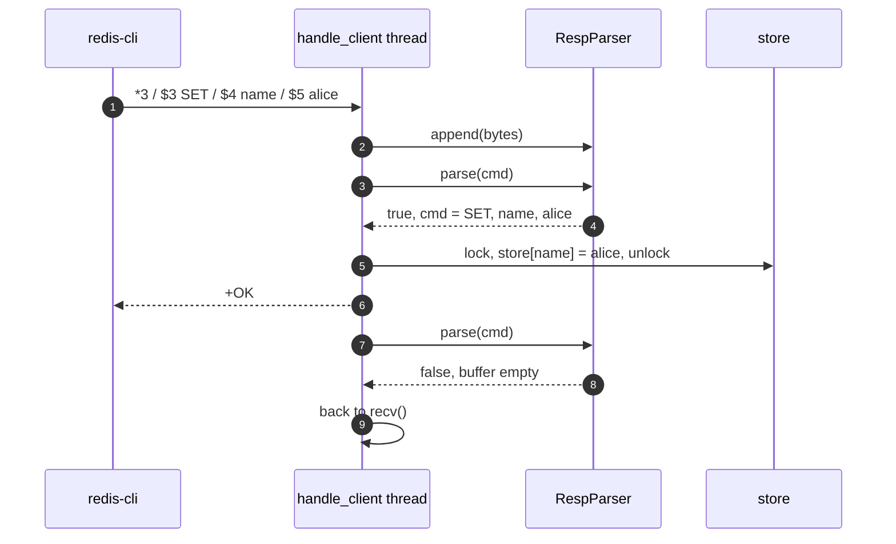

---

## Known Limitations

These are things I would be upfront about if someone reviews the project:

| Area | Limitation |
|---|---|
| **Commands** | Only 5 commands. No `DEL`, `EXISTS`, `INCR`, `EXPIRE`, `TTL`, lists, hashes, etc. |
| **SET options** | Only `PX` is understood. `EX`, `NX`, `XX`, `KEEPTTL` are silently ignored (the key is still set, without TTL) |
| **CONFIG** | Returns a fixed reply regardless of arguments. It only exists to satisfy `redis-benchmark` |
| **Expiry** | Lazy only. Expired keys that are never read again are never freed (memory leak for TTL-heavy workloads) |
| **Parser robustness** | `stoi`/`stoll` throw on non-numeric input and are not wrapped in try/catch, so a malformed request can crash the whole process. A frame that has `*` but no `$` returns `false` forever and stalls that connection |
| **Scalability** | One OS thread per client does not scale to thousands of connections. One global mutex serializes all store access |
| **Networking** | `send()` return values are not checked (partial writes ignored). `accept()` errors are not checked. `listen` backlog is only 5. Port 6379 is hardcoded |
| **Replies** | Each reply is sent with its own `send()` call, so pipelined commands cause many small syscalls instead of one batched write |
| **Binary safety** | `buf` is 1024 bytes per `recv`. Large values work since they accumulate in the parser buffer, but there is no max-size limit (a client can make the buffer grow unbounded) |
| **Persistence** | Purely in-memory. Everything is lost on restart |
| **Security** | No authentication, no TLS, listens on all interfaces |
| **Shutdown** | `close(server_fd)` after the infinite loop is unreachable; there is no signal handling or graceful shutdown |

---

## Ideas for Future Work

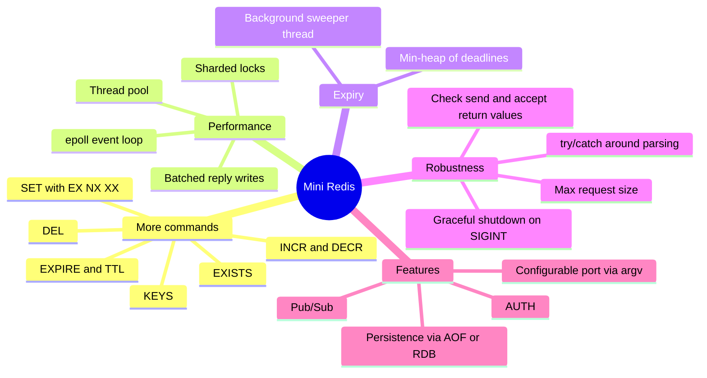

---

## Project Layout

```text
.
├── main.cpp      # entire server: store, RESP parser, client handler, main()
└── README.md
```
